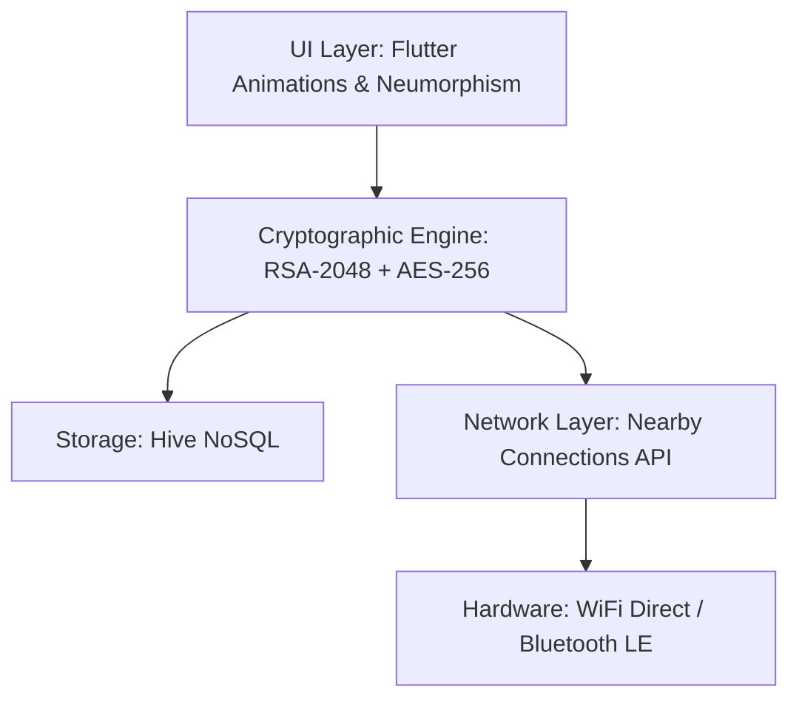

<div align="center">
  <br />
  <h1>🌑 DARKPOST // VAAHAK PROJECT</h1>
  <p>
    <strong>Built for India. No internet. No SIM. No surveillance.</strong>
  </p>
  <p>
    
    
    
  </p>
</div>

---

## 👁️ What is Darkpost?

**Darkpost** is a decentralized, off-grid communication and micro-payment platform. It operates entirely without traditional infrastructure. If the internet goes down, cellular towers collapse, or surveillance state firewalls engage—**Darkpost stays online.**

By leveraging peer-to-peer **WiFi Direct** and **Bluetooth Mesh** hardware APIs, Darkpost turns every phone into a relay node.

### Core Philosophy
- **Zero Identity:** No phone numbers, no email addresses, no central accounts. Your identity is a mathematically generated RSA-2048 keypair.
- **Absolute Privacy:** Every message is sealed with True Hybrid E2E Encryption (RSA-2048 + AES-256). 
- **Offline Value Transfer:** Send and receive UPI micro-payments entirely offline over the mesh.

---

## ⚡ Features Matrix

We have fully realized the MVP roadmap:

| Feature | Status | Description |
|---------|--------|-------------|
| **AES-256 E2E Encryption** | ✅ LIVE | Hybrid RSA/AES pipeline secured via `pointycastle`. |
| **Cryptographic Identity** | ✅ LIVE | RSA-2048 keys uniquely identify your device. |
| **P2P Hardware Mesh** | ✅ LIVE | True WiFi Direct & BT routing via `nearby_connections`. |
| **NoSQL Persistence** | ✅ LIVE | Keypairs and chat history stored locally using `hive`. |
| **Offline UPI Payments** | ✅ LIVE | Offline UPI Intent routing via deep links. |
| **Multi-hop Routing (DTN)** | 🔜 R&D | Store-and-forward relay bouncing. |

---

## 🚀 Getting Started

### Prerequisites
1. **Flutter SDK** (3.x)
2. **Android Studio** + Android SDK (API 21+)
3. A physical Android device (Hardware mesh APIs do not work on emulators!)

### Installation
1. **Clone the repository**
   ```bash
   git clone https://github.com/SONUVERMA11/DARKPOST-VAAHAK-PROJECT.git
   cd darkpost
   ```
2. **Fetch Dependencies**
   ```bash
   flutter pub get
   ```
3. **Build the Matrix**
   ```bash
   flutter run --release
   ```
   *Or generate the APK directly:*
   ```bash
   flutter build apk --release
   # APK will be in: build/app/outputs/flutter-apk/app-release.apk
   ```

---

## 🛡️ Architecture & Security

Darkpost relies on a robust 3-layer architecture:



### The Handshake Protocol
When two Darkpost nodes connect via physical proximity, they instantly execute a silent, invisible handshake. They exchange RSA Public Keys, which are saved to local Hive storage. All future packets between these nodes are encrypted with a rotating AES session key, wrapped by the recipient's RSA public key.

---

## 💳 Offline UPI Micro-payments (Phase 3)
Darkpost bridges the decentralized mesh with centralized fiat. 
1. Configure your UPI ID (e.g., `user@upi`) in the Identity Screen.
2. Hit the **Rupee** button in chat to send a Payment Request.
3. The receiver gets a glowing Neon Payment Card.
4. Tapping "PAY NOW" executes a secure Android intent (`upi://pay`), launching native banking apps (GPay, PhonePe) to complete the settlement the moment they enter internet coverage.

---

<div align="center">
  <p><i>We are the signal in the noise.</i></p>
  
</div>
